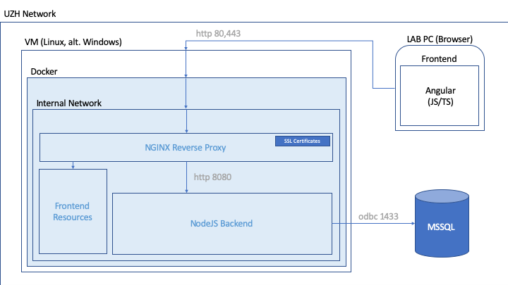
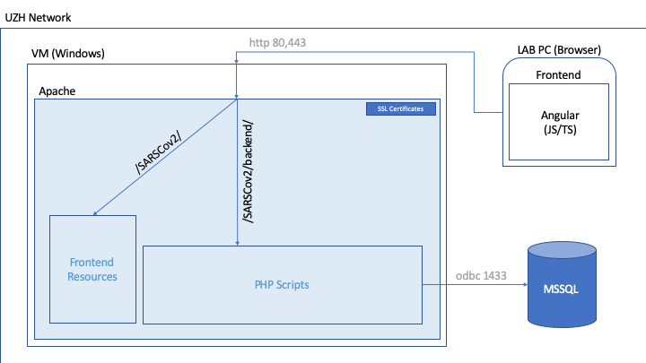
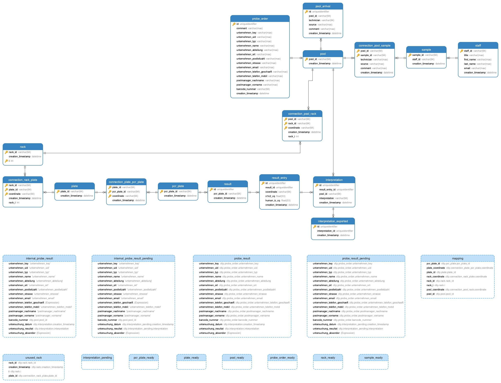
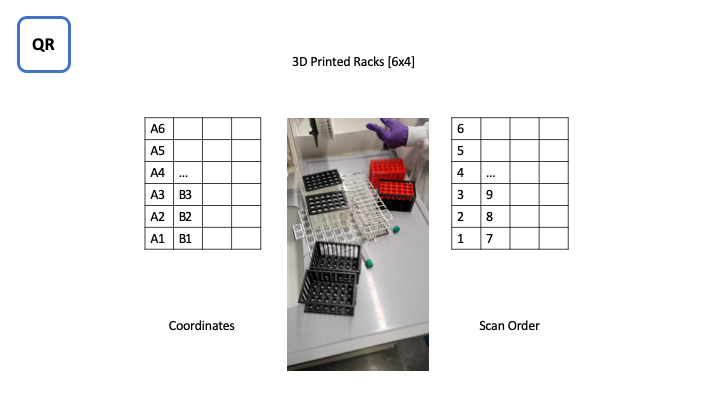
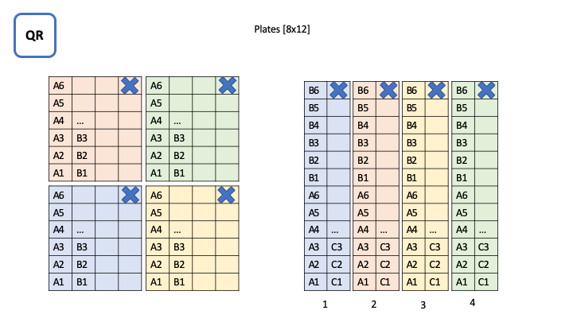
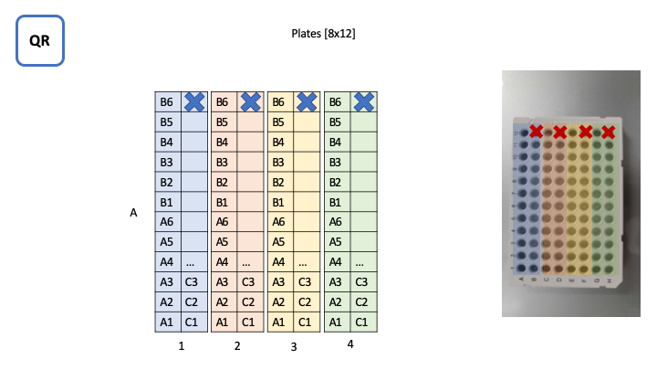
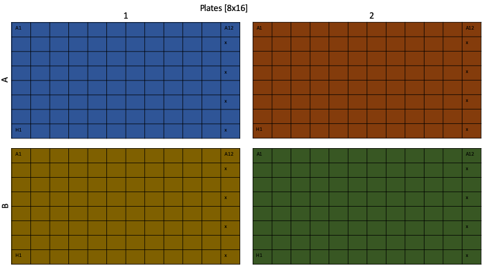
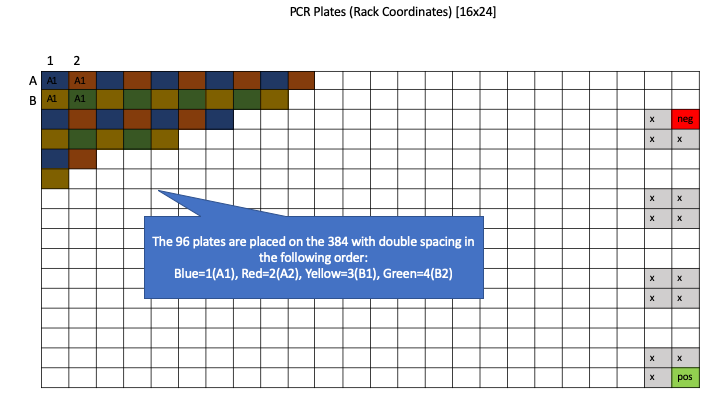
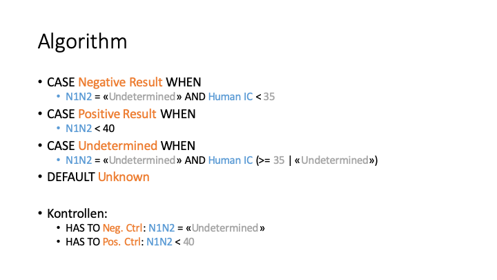
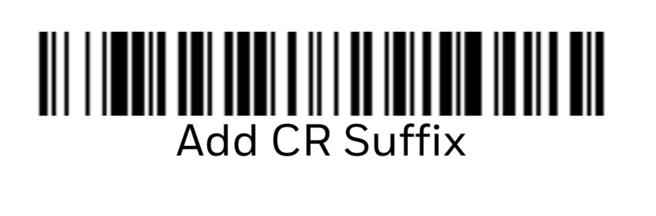

# Documentation of the System Architecture

There are two system architectures available to be deployed. The docker production deployment and the php deployment, both with an external database.

Both deployments are designed to run **exclusively** inside the internal network of the USZ infrastructure, which includes the lab PCs, the webservers and the databases.

Further, the _Frontend_ running the browser of the lab PCs are identical in both deployments and are based on Angular JS/TS, communicating with the webserver over `http(s)` through port `80`/`443`.

## Production Deployment

The production deployment based on the docker engine runs on a VM (Virtual Machine), pref. linux or alt. windows, which has the docker runtime installed. The docker containers deployed allow to completely separate the service from the host machine minimizing interference and risks in production environments.

The VM host machine must provide the docker system with permissions to receive via the ingoing ports `80` and `443` and to send through the outgoing port `1433`.

Inside the docker system, a dedicated local network is available allowing the NGINX webserver to forward the incoming request to the static resources for the _Frontend_ or via docker internal port `8080` to the _Backend_. The NGINX webserver requires the SSL certificates of the associated domain to be able to serve `https` via port `443`.

The _Backend_ receives the requests from the _Frontend_ and communicates with the _Database_ (here MSSQL) through port `1433` using a dedicated user login which exclusively gives access to the schema required by the system. 

## PHP Deployment (Alternative)

The PHP deployment based on the apache engine runs on the Windows VM (Virtual Machine), which has the apache runtime installed and preconfigured. The apache allows to host server-based websites with PHP as well as serving static files. Here, there may be multiple different services running alongside each other and are not logically separated and encapsuled, as the files are directly lying on the host machine and are accessible by the user without any security and stability measures in place.

The VM host machine is already setup and gives the apache permissions to receive via the ingoing ports `80` and `443` and to send through the outgoing port `1433`.

Inside the apache system, the "app"[^1] installed and accessible  under the path `/SARSCov2/`. The apache server redirects any incoming request to this "app". The static files for the _Frontend_ are available at the top level of the subfolder `/SARSCov2/` while the _PHP Scripts (Backend)_ are found under `/SARSCov2/backend/`.

The _PHP Scripts (Backend)_ receive the requests from the _Frontend_ and communicate with the _Database_ (here MSSQL) through port `1433` using a dedicated user login which exclusively gives access to the schema required by the system. 

[^1]: An "app" is a subfolder in the file system of an apache server consisting of a bunch of php scripts and static files for website hosting.

## Schema

The schema on the database required for the system is described [here](../sql/README.md).

The schema contains tables containing the information of the workflows present in the lab, the incoming and outgoing JSONs and an audit log of the systems activities.

## Core Functionality

There are **6** core features implemented in the system:

* Upload of probe order JSONs
* Registration of personal samples for internal staff
* Pooling of personal samples into pool
* Mapping of the lab workflow pool/rack/plate/pcr-plate
* Upload of PCR results and interpretation of results
* Export of probe result JSONs

### Upload of probe order JSONs

 Upload of the incoming JSONs can be bulk uploaded into the database.

 Example JSON: [probe-order-example.json](./probe-order-example.json)

### Registration of personal samples for internal Staff

To collect the samples of the internal staff, an interface is available where anyone, who has access to the system and is registered as staff member in the database, can upload and register their sample in the database. This requires the QR code of the staff members ID card and the QR code on the sample.

### Pooling of personal samples into Pool

Pooling of internally collected samples is guided by a workflow on the platform referencing the samples to the new pool, both identified by their QR codes.

### Mapping of the lab workflow Pool/Rack/Plate/PCR-Plate

The workflow in the lab to run the PCR has **3** steps. All elements used are identified by their respective QR codes, where pools, plates and pcr-plates are single-use and racks are multi-use.

#### Step 1: Pool/Rack Mapping

The mapping of the the pools into the racks is  done by hand and described by following illustration. First the rack has to be identified and then one after another the pools are placed inside the rack of a total of **23** pools leaving the last one _empty_.

#### Step 2: Rack/Plate Mapping

The mapping of the racks into the plate are done by a robot. First the plate needs to be identified and then one after another, the racks are placed inside the robot and the pools are transferred to the plate as illustrated below.

The plates look like this afterwards, containing up to **4** racks per plate.

#### Step 3: Plate/PCR-Plate Mapping

The mapping of the plates into the pcr-plates are done manually with a multi-transfer system and requires an advanced mapping due to the hardware limitations. First the pcr plate needs to be identified and then one after another, the pools in the plates are transferred into the pcr plate as illustrated below.

The arrangement of the up to **4** plates are like this, also representing the arrangement afterwards in the pcr plate.

The spacing of the plates is different, which is why the multi-transfer system only fills every second hole as seen for example for the first plate (which is blue). The holes are then filled with the other plates, resulting in a chess-like pattern of pools.

Important to notes is:

* The **negative** control is at `C24`
* The **positive** control is at `P24`

### Upload of PCR Results and Rnterpretation of Results

The PCR results are outputted as CSV file and contain the QR code of the pcr-plate. The csv file then can be uploaded to the database, where the mapping of the results to the pools is automatically performed as well as the interpretation of those results based on the algorithmus described below.

### Export of Probe Result JSONs

After the interpretation of the pool results, for each pool a JSON can be downloaded containing the results of the pool.

 Example JSON: [probe-result-example.json](./probe-result-example.json)

## Hardware

The hardware required to scan the QR codes identifying all elements is either a camera accessible from the browser _or_ barcode scanner ([tested with barcode scanner XenonTM XP 1950g](https://www.honeywellaidc.com/en-au/-/media/en/files-public/technical-publications/barcode-scanners/xenon/1950-en-qs.pdf)) which is capable of transferring the barcode as _USB Keyboard Input_ and terminates the transfer with an _Enter_.

### XenonTM XP 1950g

To setup the XenonTM XP 1950g barcode scanner, it needs to be configured as _Swiss USB Keyboard_ and tell it to terminate with an _Enter_.

#### Swiss USB Keyboard

#### Enter Termination

_(CR) means carriage-return and is in fact: Enter_
